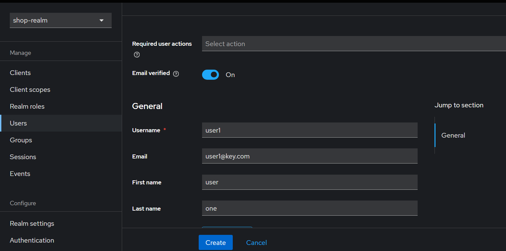
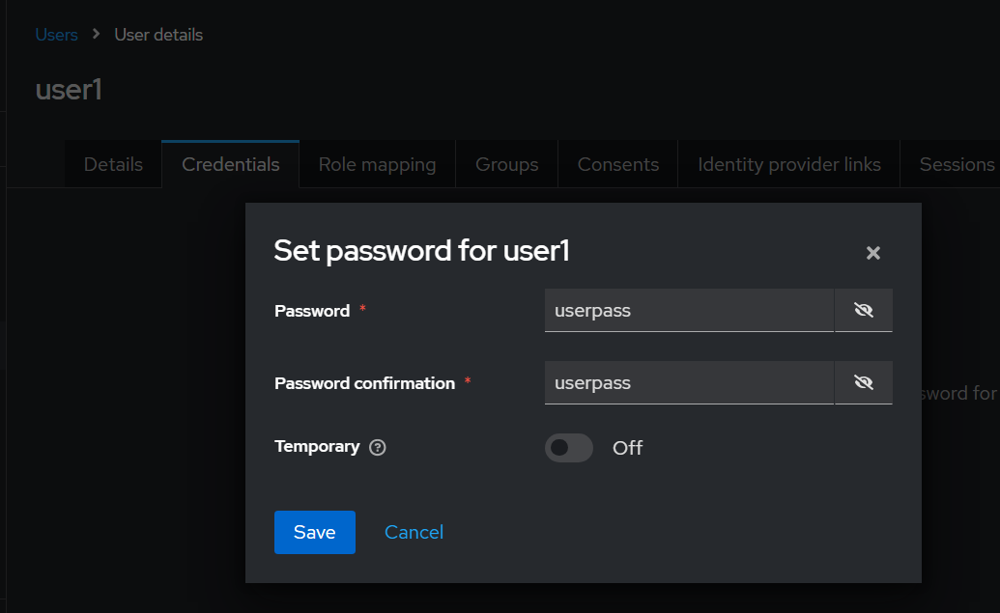

# Интернет магазин

Reactive мультимодульное Web-приложение на Spring Boot, представляющее витрину товаров, которые пользователь может добавить в корзину и купить. Используется OAuth2 с Keycloak для аутентификации и авторизации.

## Технологии

- **Java 21**, **Spring Boot 3.4.4 (Reactive)**
- **Gradle** – сборка проекта
- **Spring WebFlux** – реактивный стек для веб-приложений
- **Functional Endpoints** – (повторяют логику контроллеров из v1 версии)
- **Thymeleaf** – серверный шаблонизатор HTML с поддержкой JavaScript
- **Spring Data R2DBC** – реактивное взаимодействие с базой данных
- **MySQL 8.0** – база данных
- **OpenAPI 3.0.3** – спецификация API
- **Redis** – кэширование данных о товарах и хранение данных сервиса платежей
- **JUnit 5** – модульные и интеграционные тесты
- **WebTestClient** – для тестирования functional endpoint-ов
- **Keycloak** – сервис аутентификации и авторизации
- **Docker**
- **Testcontainers** – тестирование с использованием контейнеров

## Сервис платежей

- **URL**: http://localhost:8081/swagger-ui/index.html
- **Эндпоинты** (OAuth2 Bearer authentication is required):
  - **`POST /payments`**  
    Обрабатывает платеж.  
    **Тело запроса**:  
    ```json
    {
      "userId": "string",
      "amount": 0.0,
      "currency": "string"
    }
    ```  
    **Ответы**:  
    - `200`: Успешный платеж  
    - `400`: Неверный запрос  
    - `402`: Недостаточно средств  

  - **`GET /balances/{userId}`**  
    Возвращает баланс пользователя.  
    **Параметры**:  
    - `userId` (path): ID пользователя  
    **Ответы**:  
    - `200`: Успешное получение баланса  
    - `404`: Пользователь не найден  

## Интеграция с Keycloak

**Аутентификация на главной странице**

Главной страница (`src/main/resources/templates/main.html`) содержит кнопку **ВХОД** (сверху справа), что рендерит дефолтную форму Keycloak.

Приложение использует Keycloak для аутентификации и авторизации как пользователей, так и сервисов. В частности, для обеспечения безопасности межсервисного взаимодействия применяется клиент для service‑to‑service (Client Credentials Flow).

**Основные настройки:**
- **Адрес Keycloak:** http://localhost:8080
- **Рилм:** shop-realm (При запуске контейнера Keycloak автоматически загрузит и настроит рилм из файла из `keycloak/config/realm-export.json`)
- **Клиенты:**
  - `storefront-client` – для браузерного доступа (Authorization Code Flow)
  - `storefront-machine-client` – для service‑to‑service вызовов (Client Credentials Flow)

**Создать юзеров в keycloak, например**



**По аналогии создать еще несколько юзеров**

**Keycloak интегрирован на всех уровнях:** 
- от аутентификации пользователей (через OAuth2 и OpenID Connect). Также есть синхронизация юзеров с БД.
- до безопасного межсервисного взаимодействия (для каждого реквеста создаётся OAuth2‑запрос через `ReactiveOAuth2AuthorizedClientManager`).  
  В этой схеме **main-app** (витрина магазина) выступает как OAuth2‑клиент, а сервис **payment** — как ресурсный сервер.

## Интеграция с сервисом платежей

При нажатии на кнопку оформления заказа осуществляется REST‑запрос к сервису платежей для проверки баланса и проведения платежа.  
Если баланс на счёте меньше суммы заказа или платеж не проходит, кнопка оформления заказа становится недоступной, а в интерфейсе появляется сообщение об ошибке.  
Если сервис платежей недоступен, кнопка оформления заказа также деактивируется с выводом соответствующего сообщения.

## openApi
для main app генерируется client, а для payment - REST контроллеры

* В модуле **payment** генерится из OpenAPI‑спеки **server‑stub** (controller, DTO и delegate)
* В модуле **main‑app** генерится **клиентскую часть** (API и модели), Этот клиент идет в сервисы main-app для вызова `GET /balances/{userId}` и `POST /payments`.

Итого, один модуль отвечает за приём реквестов, а другой — за их отправку по тому же контракту OpenAPI.

## Сборка и запуск

1. **Поднять docker compose:**

   ```bash
   export MYSQL_ROOT_PASSWORD=yourDesiredPass
   export MYSQL_DATABASE=reshop # будет создана когда контейнер поднимется
   docker compose up -d
   ```

2. **Запуск приложения:**

Прокинуть env переменные `MYSQL_USER=значение` и `MYSQL_PASSWORD=значение`, а также Keycloak Client Secrets:

```bash
   $env:MYSQL_USER="значение" # лучше root
   $env:MYSQL_PASSWORD="значение" # и пассворд для рута
   $env:STORE_FRONT_CLIENT_SECRET="значение" # Client details >> Credentials >> Client Secret
   $env:STORE_FRONT_MACHINE_CLIENT_SECRET="значение" # Client details >> Credentials >> Client Secret
```

- **создание БД и таблиц** находятся в файле `resources/db/sql/createDBAndTables.sql`.
- Этот скрипт нужно запустить ДО старта приложения.

Затем выполнить сборку и запуск:
   ```bash
   gradlew build
   java -jar "build/libs/reactive shop-0.0.1-SNAPSHOT.jar"
   ```

- **начальные данные** находятся в файле `resources/db/sql/init-data.sql`.
- Этот скрипт нужно запустить после успешного старта приложения.

## Структура шаблонов

Папка `templates` находится в `src/main/resources`.

- **main.html** – главная витрина магазина, отображающая список всех товаров
- **item.html** – страница с описание товара (карточка товара)
- **cart.html** – страница с корзиной товаров
- **orders-list.html** – страница со списком всех заказов
- **order.html** – страница с деталями заказа

## Тестирование

- **Запуск тестов с использованием testcontainers:**

  ```bash
  ./gradlew test
  ```

  Тесты включают модульные и интеграционные, охватывающие основные компоненты приложения.

## Эндпоинты приложения

- **GET \"/\"**  
  Редирект на \"/main/items\"

- **GET \"/main/items\"**  
  Вывод списка всех товаров плиткой на главной странице

- **POST \"/main/items/{id}\"**  
  Изменение количества товара в корзине

- **GET \"/cart/items\"**  
  Вывод содержимого корзины

- **POST \"/cart/items/{id}\"**  
  Изменение количества товара в корзине

- **GET \"/items/{id}\"**  
  Карточка товара

- **POST \"/items/{id}\"**  
  Изменение количества товара в корзине

- **POST \"/buy\"**  
  Оформление покупки – выполняет покупку товаров в корзине и очищает ее

- **GET \"/orders\"**  
  Вывод списка заказов

- **GET \"/orders/{id}\"**  
  Карточка заказа

